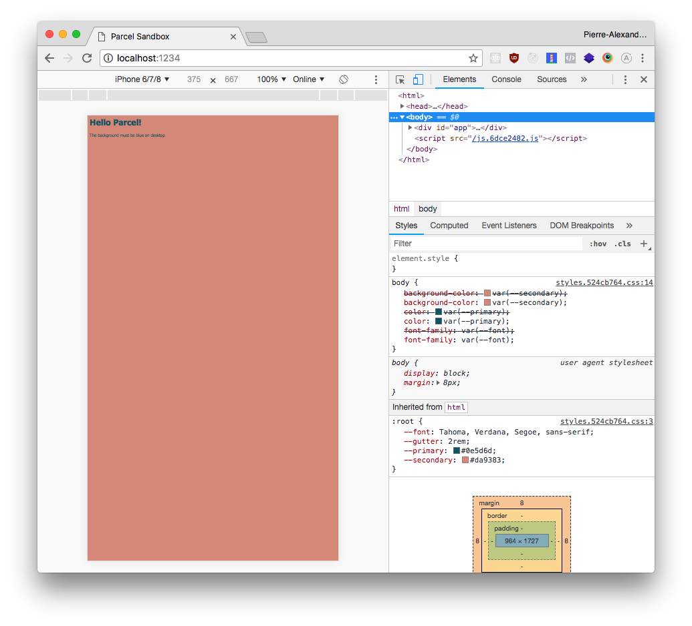

This is a simple repo to reproce a bug with parceljs and `postcss-preset-env` plugin.

On mac OS there is several bugs

On dev mode :

- the custom variables are not converted as there are on https://preset-env.cssdb.org/playground
- the custom variables are duplicated
- the style defined in the `@custom-media` queries is deleted instead of been "transpiled"

On build mode :

- the custom variables are no more duplicated but the other issues still occur

```bash
yarn && yarn start
```


